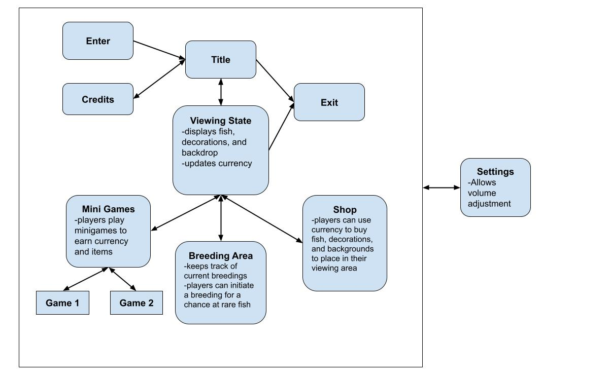

# Architecture
### Key Architectural Drivers
- *Game States:* The game is represented by states that a player traverses through as they play the game. After a player enters a state, there is no communication with any other states. In other words, states are self-sufficient.
- *Single Player:* There is no need to document how the game interacts with other sources, because it does not depend on any other source.
- User sends data to current state that determines state procedures and/or state transitions.

### Architectural Style Choices
- *Peer-to-Peer (P2P)*
  - As players transition from one state to another, data is also transferred so that game data will be retained. States rely on this data when entered.
- *Pipe-and-Filter*
  - Program moves from one state to another, where each state is independent of the others. States can transition only to a certain set of other states.
- *Repository*
  - All game data is saved in a set of directories. Each state would access these files to perform necessary functions.

### Architecture Diagram

### Conclusion
We thought that Pipe-and-Filter architecture best fit our program. It is a robust architecture that allows us to easily adapt our program while maintaining its original purpose. The architecture also fits the idea of players traversing through states as they play the game. Each state on its own also executes a certain set of procedures to display content to the player.
