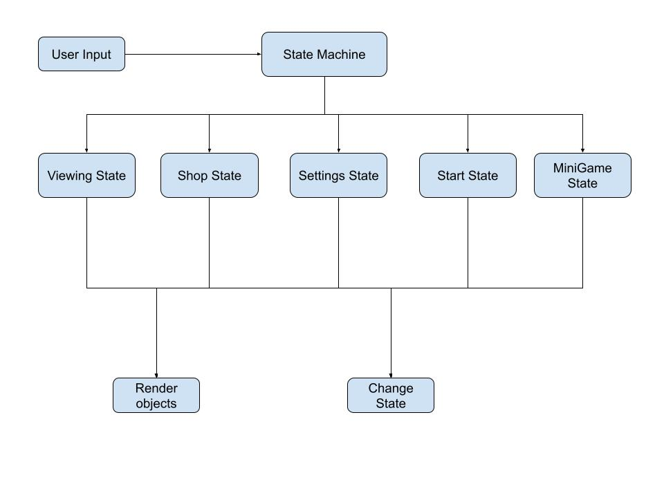

# Design
### Updated Architecture Diagram:

Our program is comprised of State classes and Object classes. States are managed by the State Machine, which takes user input and uses it to control the behavior of the game, and navigate to the appropriate State. State Classes are managed by a parent Base state class. Each State Class has an enter, exit, update, and render function. Our state classes are:
- ViewingState
  - displays fish
  - updates currency
  - gives access to all other states
- StartState
  - displays the title
  - gives access to Viewing and Settings States
- ShopState
  - allows user to buy new Fish
  - those fish are then placed in the Viewing State
- SettingsState
  - allows the user to change game options
  - options are carried over to other states
- MiniGameState
  - allows players to play certain minigames which earn them extra coins

The Object classes include Fish and Slider. Buttons, Backgrounds, and decorations will be added in the future. These objects all have x, y coordinates as well as a width and height variable for placement and rendering on the screen. They also have elements specific to each that allow full functionality (i.e., the fish hold skin and color variables for what type of Fish to print).
